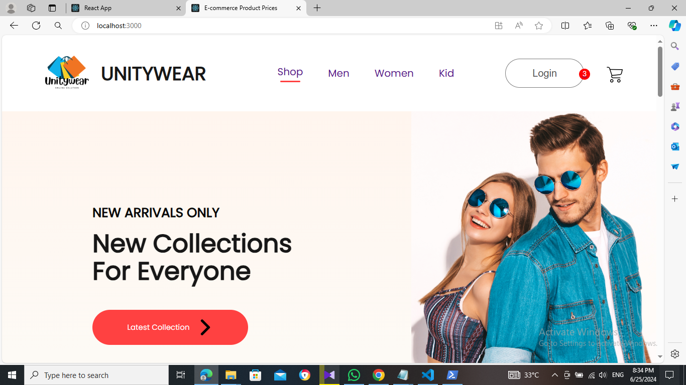
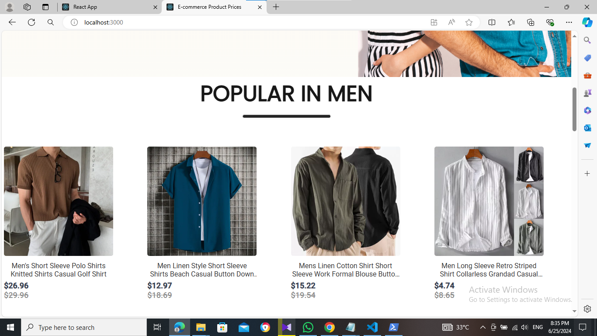
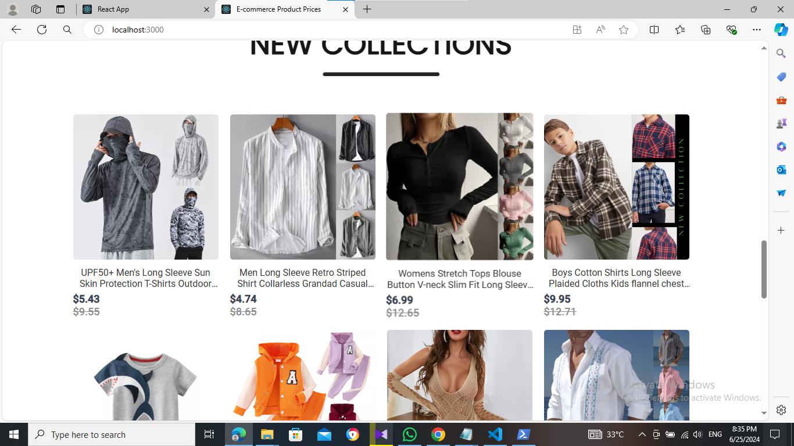
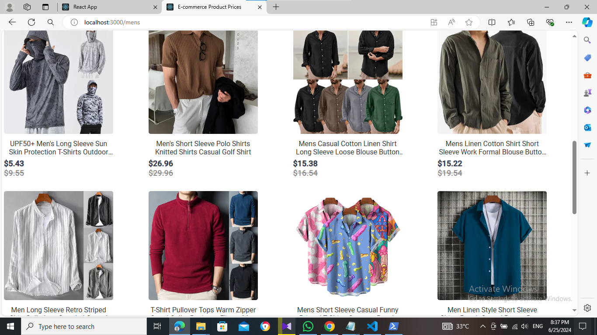
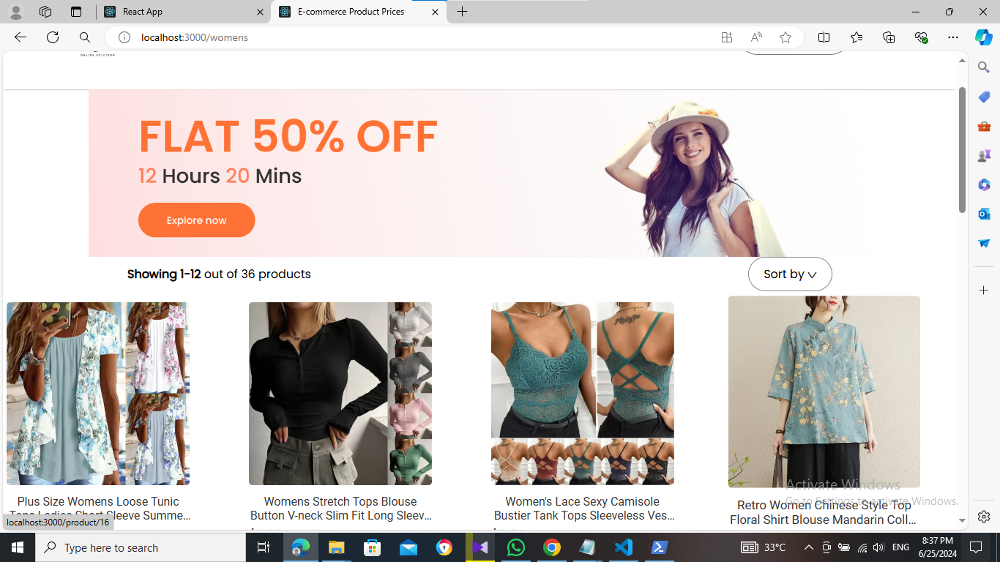
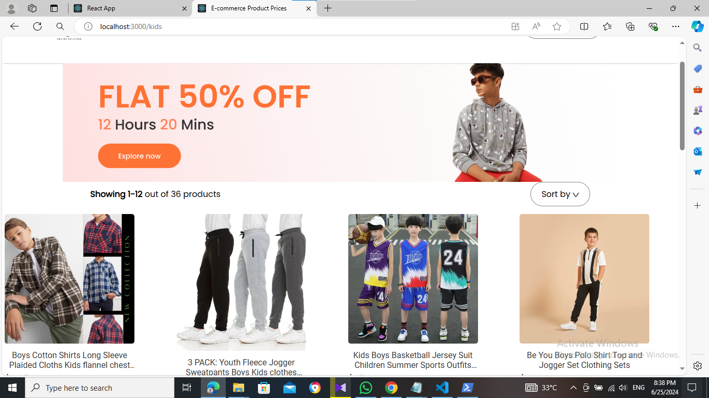
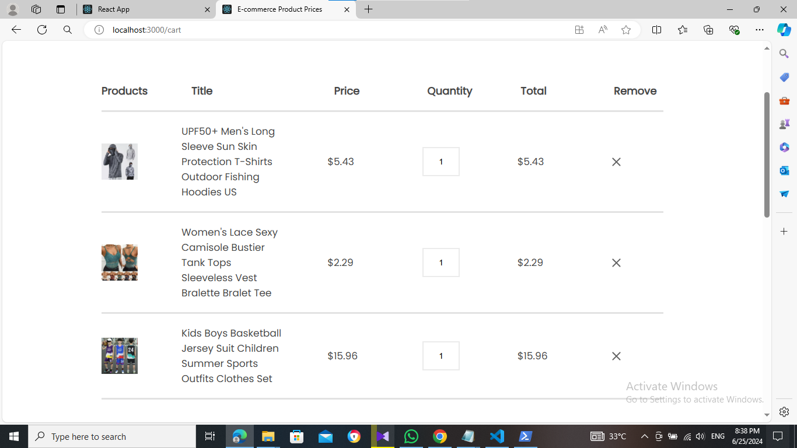

# E-commerce Website Frontend



A modern E-commerce website frontend built with React.js, Node.js, HTML, CSS, and JavaScript. This project showcases a responsive and functional shopping platform with essential features.

## Table of Contents

- [Project Description](#project-description)
- [Features](#features)
- [Technologies Used](#technologies-used)
- [Installation](#installation)
- [Usage](#usage)
- [Screenshots](#screenshots)
- [Contributing](#contributing)
- [License](#license)
- [Acknowledgements](#acknowledgements)

## Project Description

The E-commerce website frontend is a fully responsive and functional shopping platform built with React.js. It integrates seamlessly with a backend (assumed to be built with Node.js) and offers a smooth user experience for browsing products, adding items to the cart, and checking out.

## Features

- Product listing and detail pages
- Shopping cart functionality
- User authentication and authorization
- Responsive design for all devices
- Integration with a backend API

## Technologies Used

- **Node.js**: Backend runtime environment
- **React.js**: Frontend library for building user interfaces
- **HTML**: Structure of the website
- **CSS**: Styling the website
- **JavaScript**: Adding interactivity
- **VS Code**: Code editor

## Installation

To get a local copy up and running, follow these steps:

1. **Clone the repository**:
    ```bash
    git clone https://github.com/CODdinusha/E-commerce-web-site.git
    cd e-commerce-frontend
    ```

2. **Install dependencies**:
    ```bash
    npm install
    ```

3. **Start the development server**:
    ```bash
    npm start
    ```

## Usage

Once the development server is running, you can access the E-commerce website in your web browser at `http://localhost:3000`. Browse products, add items to your cart, and experience the user interface.

## Screenshots

### Home Page




### Men Page


### Women Page


### Kids Page


### Cart Page



## License

Distributed under the MIT License. See `LICENSE` for more information.

## Acknowledgements

- [Node.js](https://nodejs.org/)
- [React.js](https://reactjs.org/)
- [Visual Studio Code](https://code.visualstudio.com/)
- [GitHub Pages](https://pages.github.com/)
